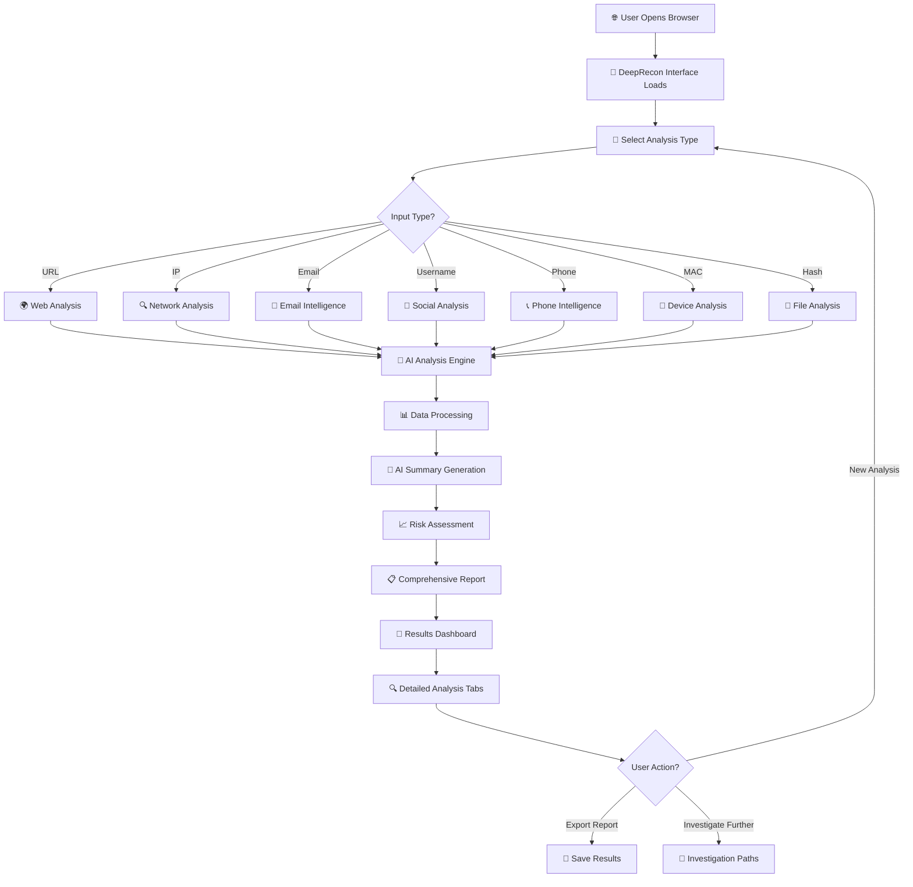

# 🚀 How to Run DeepRecon OSINT Platform


## ⚡ Quick Start (3 Steps)

```bash
# 1. Install Dependencies
npm install

# 2. Start Development Server
npm run dev

# 3. Open Browser
# Navigate to http://localhost:8080
```

---

## 🔄 Application Flow Chart



---

## 🎯 Key Features & Highlights

### ✨ **Core Capabilities**
- **8 Input Types**: URL, IP, Email, Username, Phone, Domain, MAC, Hash
- **AI-Powered Analysis**: Intelligent threat assessment and pattern recognition
- **Real-Time Processing**: Live analysis with progress indicators
- **Comprehensive Reports**: 6 detailed analysis tabs with actionable insights

### 🔥 **Technical Highlights**
- **⚡ Lightning Fast**: Vite + React 18 with instant hot reloading
- **🛡️ Type Safe**: Full TypeScript implementation
- **🎨 Modern UI**: Tailwind CSS + Radix UI components
- **📱 Responsive**: Works perfectly on desktop, tablet, and mobile

---

## 📋 How It Works (Step by Step)

### 1. **🚀 Application Startup**
```bash
npm run dev
# ✅ Vite server starts on http://localhost:8080
# ✅ React app renders with hot module replacement
# ✅ TypeScript compiler watches for changes
```

### 2. **🎯 User Input Selection**
- User selects analysis type (URL, IP, Email, etc.)
- Input validation runs in real-time
- Examples and format hints provided

### 3. **🤖 AI Analysis Process**
```typescript
// Analysis Flow
Input → Validation → AI Engine → Multi-Source Analysis → Results
```

### 4. **📊 Results Generation**
- **Overview**: Basic info and threat assessment
- **Network**: Geolocation, DNS, SSL analysis
- **Security**: Vulnerability scanning and risk scoring
- **Social**: Social media footprint analysis
- **Intelligence**: Threat intelligence from multiple sources
- **Investigation**: AI-suggested investigation paths

---

## 🛠️ Development Commands

| Command | Purpose | Usage |
|---------|---------|--------|
| `npm run dev` | Start development server | Local development with HMR |
| `npm run build` | Production build | Optimized build for deployment |
| `npm run preview` | Preview production build | Test production build locally |
| `npm run lint` | Code quality check | ESLint validation |

---

## 🔍 Project Structure Flow

```
📁 src/
├── 📱 pages/Index.tsx          → Main application entry point
├── 🧩 components/
│   ├── OSINTAnalyzer.tsx       → Input selection and form
│   ├── OSINTResults.tsx        → Results display with tabs
│   └── ui/                     → Reusable UI components
├── 🤖 utils/osintAnalyzer.ts   → AI analysis engine
├── 📋 types/osint.ts           → TypeScript definitions
└── 🎨 CSS/Styling              → Tailwind CSS classes
```

---

## 🎪 User Journey

### **🏁 Start → Analysis → Results**

1. **Landing** → User sees clean interface with analysis options
2. **Selection** → Choose input type (URL, IP, Email, etc.)
3. **Input** → Enter data with real-time validation
4. **Analysis** → AI engine processes with progress indicator
5. **Results** → Comprehensive dashboard with 6 analysis tabs
6. **Action** → Export, investigate further, or start new analysis

---

## 🚨 Troubleshooting

### **Common Issues & Solutions**

| Issue | Solution |
|-------|----------|
| Port 8080 in use | `npm run dev -- --port 3000` |
| Node.js not found | Install Node.js 18+ from nodejs.org |
| Dependencies error | `rm -rf node_modules && npm install` |
| TypeScript errors | Check `tsconfig.json` and restart IDE |

---

## 🔧 System Requirements

- **Node.js**: Version 18.0.0 or higher
- **npm**: Version 9.0.0 or higher
- **Browser**: Chrome, Firefox, Safari, Edge (ES2020 support)
- **Memory**: 4GB RAM minimum for development
- **Disk**: 500MB free space

---

## 🎯 Performance Metrics

### **Development Mode**
- **Cold Start**: ~2-3 seconds
- **Hot Reload**: ~100ms
- **Build Time**: ~10-15 seconds

### **Production Mode**
- **Bundle Size**: ~500KB gzipped
- **First Paint**: <1 second
- **Interactive**: <2 seconds

---

## 🔗 Quick Links

- **🌐 Application**: http://localhost:8080
- **📊 Dev Tools**: React DevTools, TypeScript errors in console
- **🔍 Source Code**: Open `src/` folder in your IDE
- **📚 Tech Stack**: See `Tech_Stack.md` for detailed information

---

## 💡 Pro Tips

### **🚀 Development Efficiency**
- Use **React DevTools** browser extension for component debugging
- Enable **TypeScript strict mode** for better error catching
- Use **ESLint autofix** in your IDE for consistent code style
- **Hot reload** preserves component state during development

### **🎯 Best Practices**
- Always validate input before analysis
- Check browser console for any TypeScript errors
- Use the **investigation paths** for deeper OSINT research
- Export results before starting new analysis

---

**🎉 You're Ready to Go!**  
*DeepRecon OSINT Platform is now running and ready for intelligence analysis.*

---

**💬 Need Help?**  
Check the browser console for errors or refer to `Tech_Stack.md` for detailed technical information.